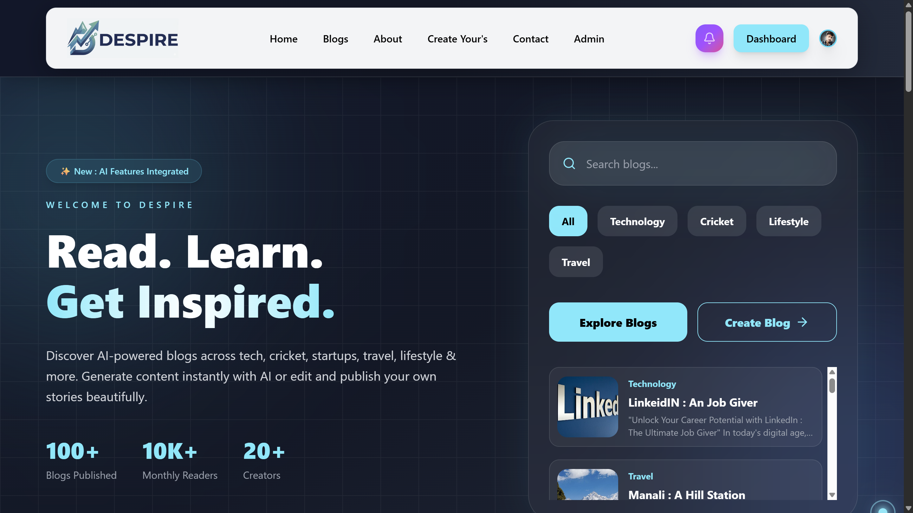
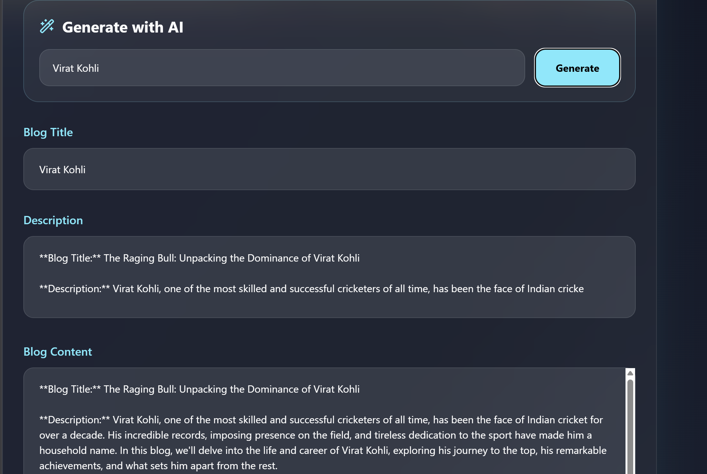
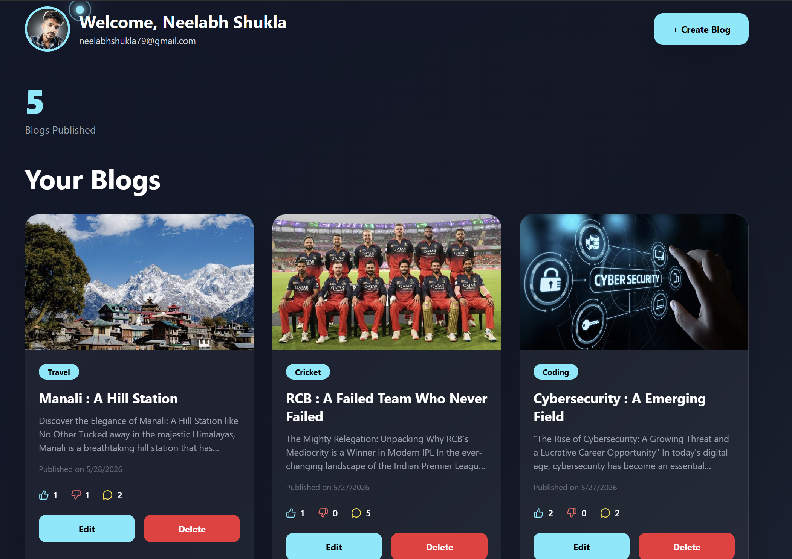
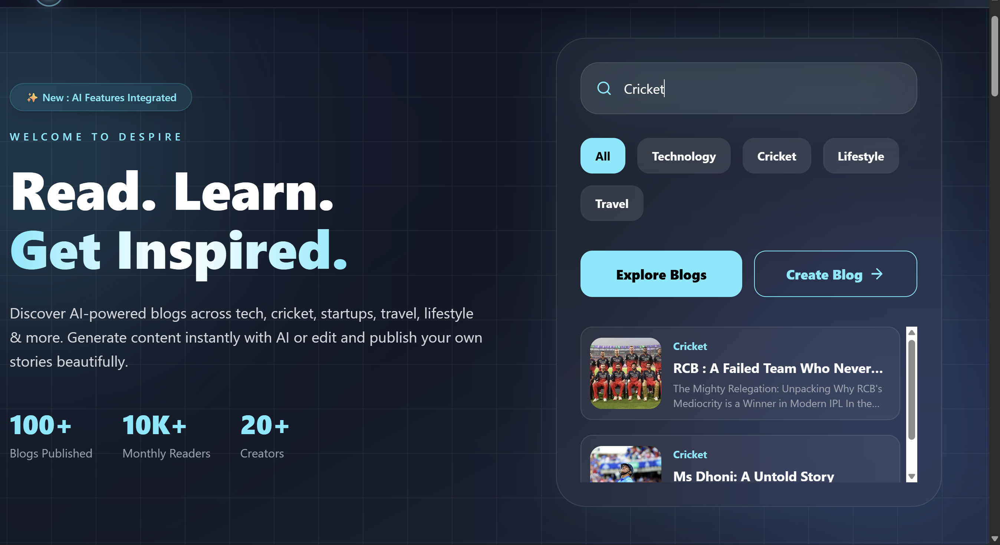
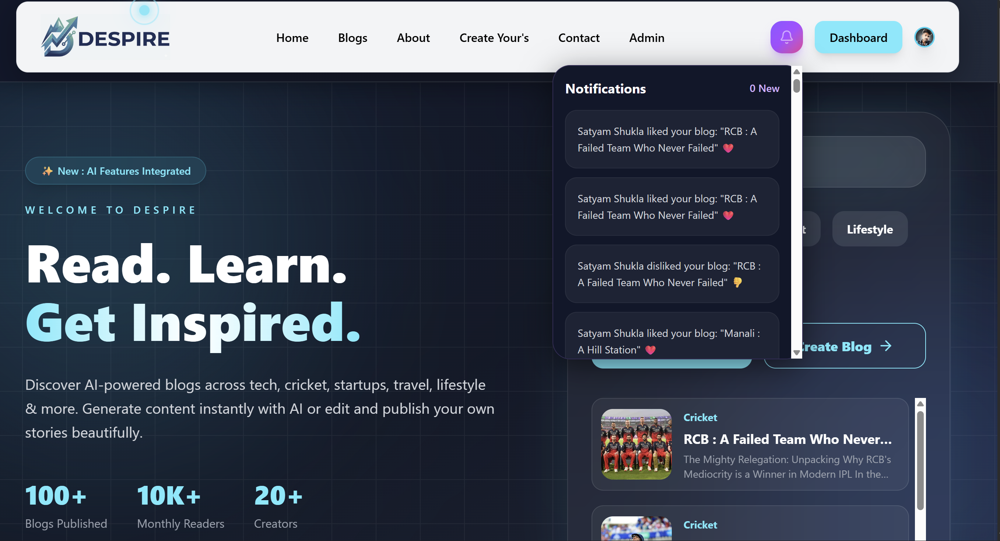
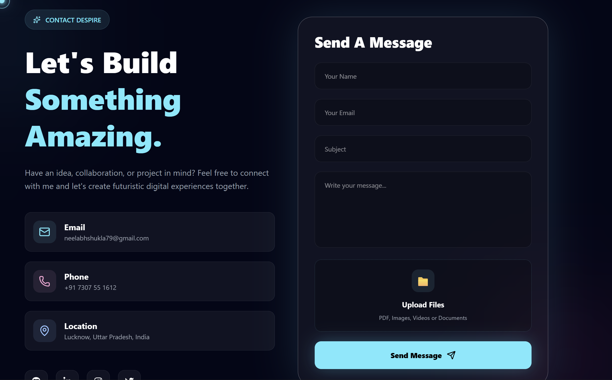

# 🌌 DESPIRE — Explore Stories Powered by AI

<p align="center">
  
</p>

---
## 🖼️ Preview

<p align="center">
  
  
</p>

<p align="center">
  
  
</p>

<p align="center">
  
  
</p>

<p align="center">
  
</p>


### 📝 Blog Details Preview


# 🛠️ Tech Stack

| Frontend      | Backend    | Database   | Authentication | Deployment |
| ------------- | ---------- | ---------- | -------------- | ---------- |
| React.js      | Node.js    | MongoDB    | Clerk Auth     | Netlify    |
| Tailwind CSS  | Express.js | Mongoose   | JWT            | Render     |
| Framer Motion | Nodemailer | Cloudinary | Cookies        | GitHub     |

---


# ✨ About DESPIRE

## 🌌 What You Can Do With DESPIRE

DESPIRE is a modern AI-powered full-stack blogging platform built for readers, creators, and explorers.

### 🔍 Smart Blog Search

Instantly search blogs across technology, cricket, startups, travel, lifestyle, spirituality, and more using powerful AI-based search.

### ❤️ Like & Engage

Show appreciation to your favorite blogs with likes and interactive engagement features.

### 💬 Real-Time Comments

Join discussions, share opinions, and interact with other readers through the comment system.

### 📝 Create & Edit Blogs

Write your own blogs beautifully with a modern editor, edit them anytime, and publish your stories instantly.

### 🤖 AI Content Generation

Generate blog ideas and full blog content instantly using integrated AI tools, then customize everything your way.

### 👤 Secure Authentication

Login and manage your account securely with protected authentication and personalized access.

### 📧 Email Notifications

Receive notifications for comments, interactions, and important updates directly through email.

### 🎨 Modern Responsive UI

Enjoy a smooth, fast, and fully responsive experience across desktop, tablet, and mobile devices.

### ⚡ Full MERN Stack Powered

Built using MongoDB, Express.js, React.js, and Node.js for high performance and scalability.

* 🌙 Experience modern responsive UI

The project is built using the MERN Stack with powerful frontend animations and backend integrations.

---

# 📂 Real Project Structure

```bash
DESPIRE/
│
├── backend/
│   │
│   ├── config/
│   │   ├── cloudinary.js
│   │   ├── db.js
│   │   └── sendmail.js
│   │
│   ├── controllers/
│   │   ├── aiController.js
│   │   └── blogController.js
│   │
│   ├── middleware/
│   │   ├── multer.js
│   │   └── upload.js
│   │
│   ├── models/
│   │   ├── blog.js
│   │   ├── contactModel.js
│   │   ├── follow.js
│   │   └── notification.js
│   │
│   ├── routes/
│   │   ├── aiRoutes.js
│   │   ├── blogRoutes.js
│   │   ├── contactRoutes.js
│   │   ├── followRoutes.js
│   │   └── notificationRoutes.js
│   │
│   ├── .env
│   ├── package.json
│   ├── package-lock.json
│   └── server.js
│
├── frontend/
│   │
│   ├── public/
│   │   ├── favicon-2.png
│   │   ├── main-favicon.svg
│   │   │
│   │   ├── About/
│   │   │   ├── about.jpeg
│   │   │   ├── believe.jpg
│   │   │   ├── signature.jpg
│   │   │   ├── video-d.mp4
│   │   │   ├── video2.mp4
│   │   │   ├── video3.mp4
│   │   │   └── video4.mp4
│   │   │
│   │   └── Hero-section/
│   │       └── Navbar/
│   │           └── headerlogo.png
│   │
│   ├── src/
│   │   ├── assets/
│   │   ├── Components/
│   │   │   ├── AboutUsPage.jsx
│   │   │   ├── AdminMessage.jsx
│   │   │   ├── Blog.jsx
│   │   │   ├── BlogDetails.jsx
│   │   │   ├── ContactUs.jsx
│   │   │   ├── CreateBlog.jsx
│   │   │   ├── CustomCursor.jsx
│   │   │   ├── Dashboard.jsx
│   │   │   ├── EditBlog.jsx
│   │   │   ├── Footer.jsx
│   │   │   ├── Hero-section.jsx
│   │   │   ├── Home.jsx
│   │   │   ├── Login.jsx
│   │   │   ├── Navbar.jsx
│   │   │   ├── ScrollToTop.jsx
│   │   │   └── Signup.jsx
│   │   │
│   │   └── services/
│   │       └── blogservice.js
│   │
│   ├── App.css
│   ├── App.jsx
│   ├── index.css
│   ├── main.jsx
│   ├── .env
│   ├── .gitignore
│   ├── eslint.config.js
│   ├── index.html
│   ├── package.json
│   ├── package-lock.json
│   ├── README.md
│   └── vite.config.js
│
└── README.md
```

---

# 🎯 Core Features

## 🤖 AI Blog Generator

DESPIRE includes an AI powered blog creation system.

### ✨ How It Works

```text
User Writes Blog Title
        ↓
AI API Receives Prompt
        ↓
Backend Processes Request
        ↓
AI Generates Blog Content
        ↓
Editor Opens Instantly
        ↓
User Can Edit Anytime
```

### 🚀 Smart Workflow

Users only need to:

* Enter blog title
* Select category
* Click generate

Then AI automatically creates:

* Blog introduction
* Main content
* Structured paragraphs
* Creative writing flow
* SEO friendly text

---

## ✍️ Real-Time Editing System

Users can:

* Edit blog instantly
* Save drafts
* Update later
* Modify titles
* Replace images
* Rewrite AI content

This gives creators full control over generated content.

---

## 🔔 Notification System

DESPIRE has a dynamic notification feature.

### Notifications Include

* New followers
* Blog interactions
* Likes
* Comments
* Admin announcements
* System alerts

### Backend Workflow

```text
Action Happens
      ↓
Notification Model Triggered
      ↓
MongoDB Stores Notification
      ↓
Frontend Fetches Notifications
      ↓
UI Updates Instantly
```

---

## 🛡️ Admin Panel

The admin dashboard allows platform management.

### Admin Features

* Manage blogs
* Delete content
* Edit blogs
* View user activities
* Handle notifications
* Review contact messages
* Monitor platform interactions

---

## 📩 Contact System

Users can send messages directly through DESPIRE.

### Contact Workflow

```text
User Fills Contact Form
         ↓
Frontend Sends Request
         ↓
Backend Validates Data
         ↓
MongoDB Stores Message
         ↓
Admin Receives Access
```

---

## 🔍 Intelligent Search Engine

DESPIRE includes advanced search functionality.

### Search Features

* Instant search
* Dynamic filtering
* Partial matching
* Case insensitive search
* Real-time UI updates
* Optimized MongoDB queries

---

## 📱 Fully Responsive UI

The platform is optimized for:

* Mobile devices
* Tablets
* Large desktops
* Ultra-wide screens

---

## 🌙 Modern User Experience

DESPIRE uses:

* Smooth animations
* Interactive hover effects
* Animated cursors
* Video hero sections
* Glassmorphism inspired UI
* Tailwind responsive utilities

---

# ⚡ Features

## 🌍 1. Blog Search System

Users can search blogs instantly using keywords.

### 🔄 How It Works

```text
User Types Query
       ↓
Frontend Captures Input
       ↓
API Request Sent To Backend
       ↓
MongoDB Searches Blogs
       ↓
Matched Blogs Returned
       ↓
UI Updates Dynamically
```

---

## 🔍 Search Flow Explained

### Frontend Search

We use:

```js
useState()
```

to store the search input.

Example:

```js
const [search, setSearch] = useState('')
```

### Why We Use useState?

Because React needs dynamic UI updates whenever the user types.

---

### API Call

We use:

```js
axios.get()
```

Example:

```js
axios.get(`/api/blog/search?query=${search}`)
```

### Why Axios?

* Cleaner than fetch
* Easy error handling
* Better API management
* Automatic JSON parsing

---

### Backend Route

```js
router.get('/search', searchBlogs)
```

This route receives the search query.

---

### Controller Logic

```js
Blog.find({
  title: { $regex: query, $options: 'i' }
})
```

### Why Regex?

Because regex allows:

* Partial matching
* Case insensitive searching
* Flexible search experience

Example:

Searching:

```text
react
```

Can match:

```text
React.js Guide
Learn React Fast
```

---

# ❤️ Like System

## Flow

```text
User Clicks Like
      ↓
Frontend Sends Request
      ↓
Backend Updates Database
      ↓
Like Count Changes Instantly
```

---

## Why We Use Local State?

To make UI feel fast without refreshing page.

---

# 💬 Comment System

Users can add comments under blogs.

## Comment Flow

```text
User Writes Comment
      ↓
Comment Stored In MongoDB
      ↓
Frontend Re-fetches Comments
      ↓
Comments Render Dynamically
```

---

# 🔐 Authentication System

DESPIRE uses Clerk Authentication.

## Why Clerk?

Because Clerk provides:

* Easy authentication
* Google login
* Secure session handling
* JWT tokens
* Modern UI components

---

# 📧 Email Notification System

We use:

```text
Nodemailer
```

## Why Nodemailer?

To send:

* Comment notifications
* Welcome emails
* Blog alerts

---

# ☁️ Cloudinary Integration

Cloudinary stores blog images.

## Why Cloudinary?

Because it provides:

* Fast image hosting
* Automatic optimization
* CDN delivery
* Secure uploads

---

# 🎨 Tailwind CSS

DESPIRE UI is built using Tailwind CSS.

## Why Tailwind?

* Faster styling
* Responsive utilities
* Modern UI design
* No large CSS files
* Easy dark mode support

Example:

```html
<div className="bg-black text-white p-6 rounded-2xl">
```

---

# ✨ Framer Motion Animations

We use Framer Motion for:

* Page animations
* Hover effects
* Reveal transitions
* Smooth UI interactions

## Why Framer Motion?

Because animations become easier and smoother.

Example:

```js
<motion.div
  initial={{ opacity: 0 }}
  animate={{ opacity: 1 }}
>
```

---

# 📱 Responsive Design

DESPIRE works on:

* 📱 Mobile
* 💻 Laptop
* 🖥️ Desktop
* 📟 Tablet

Using:

```text
Tailwind Breakpoints
```

Example:

```html
lg:flex-row
md:grid-cols-2
```

---

# 🧠 State Management

We use:

```text
React Context API
```

## Why Context API?

To share:

* User data
* Blog data
* Authentication state
* Theme settings

without prop drilling.

---

# ⚙️ Backend Architecture

## Express.js

Handles:

* API routes
* Middleware
* Authentication
* Database communication

---

# 🗄️ MongoDB Database

Stores:

* Users
* Blogs
* Likes
* Comments
* Notifications

---

# 🔗 Mongoose

We use Mongoose to connect Node.js with MongoDB.

## Why Mongoose?

* Easy schema creation
* Validation
* Cleaner queries
* Better structure

Example:

```js
const blogSchema = new mongoose.Schema({
  title: String,
  description: String,
  image: String
})
```

---

# 🚀 Deployment

## Frontend Deployment

Platform:

```text
Netlify
```

### Why Netlify?

* Ultra fast deployment
* Great for React + Vite
* Continuous deployment
* Easy domain setup
* GitHub integration
* Environment variable support

---

## Backend Deployment

Platform:

```text
Render
```

### Why Render?

* Easy backend hosting
* Environment variable support
* MongoDB compatibility
* Free deployment support

---

# 🔒 Environment Variables

Example:

```env
MONGO_URI=
JWT_SECRET=
CLERK_SECRET_KEY=
CLOUDINARY_API_KEY=
```

## Why Use .env?

To keep secret keys secure.

---

# 🧪 API Testing

DESPIRE APIs are tested using:

```text
Thunder Client (VS Code Extension)
```

## Why Thunder Client?

* Lightweight API testing
* Direct VS Code integration
* Fast request testing
* Better developer workflow
* JSON response preview
* Route debugging

### Tested APIs

* Create blog
* AI generate content
* Search blogs
* Notification APIs
* Contact routes
* Authentication routes
* Follow system APIs

---


# 🧩 Packages Used

| Package          | Why We Use It                  |
| ---------------- | ------------------------------ |
| react-router-dom | Routing between pages          |
| axios            | API requests                   |
| mongoose         | MongoDB integration            |
| express          | Backend server                 |
| cors             | Frontend-backend communication |
| dotenv           | Environment variables          |
| nodemailer       | Email sending                  |
| framer-motion    | Animations                     |
| react-hot-toast  | Toast notifications            |
| cloudinary       | Image storage                  |
| multer           | File uploads                   |
| bcryptjs         | Password hashing               |
| jsonwebtoken     | Secure tokens                  |

---

# 🔥 Future Improvements

* 🤖 AI blog recommendations
* 🎙️ Voice search
* 🌐 Multi-language support
* 📈 Analytics dashboard
* 🧠 AI blog summarizer
* 📹 Video blogs
* 📲 Mobile app version

---

# 🧑‍💻 Author

## 👨‍💻 Neelabh Shukla

### Full Stack Developer | Java Enthusiast | Frontend Developer

* 💻 GitHub: [https://github.com/neelabhshukla018](https://github.com/neelabhshukla018)
* 🔗 LinkedIn: [https://www.linkedin.com/in/neelabh-shukla-45b88a2a5](https://www.linkedin.com/in/neelabh-shukla-45b88a2a5)
* 🧠 LeetCode: [https://leetcode.com/u/sirneelabhshuklaji/](https://leetcode.com/u/sirneelabhshuklaji/)

---

# ⭐ Support

If you like this project:

* ⭐ Star the repository
* 🍴 Fork the project
* 🧑‍💻 Contribute improvements
* 📢 Share with developers

---

# 🧠 Why DESPIRE Stands Out

DESPIRE is not just another MERN stack blog project.

It combines:

* AI generated content
* Smart search systems
* Dynamic notifications
* Modern UI animations
* Admin management tools
* Cloud image storage
* Real-time interactions
* Responsive user experience
* Full stack architecture
* Production deployment workflow

This project demonstrates:

✅ Frontend engineering

✅ Backend architecture

✅ API handling

✅ Database management

✅ AI integration

✅ Authentication systems

✅ Deployment skills

✅ Real-world scalable structure

---

# 💫 Final Vision

DESPIRE is not just a blogging platform.

It is a place where:

> Ideas become stories.
>
> Stories inspire people.
>
> And inspiration creates impact.

---

<p align="center">
  Made with ❤️ by Neelabh Shukla
</p>
